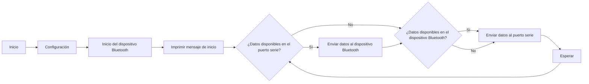

# Practica 3A: WiFi Pagina Web
## Objetivos: 
- Conectarse a una red WiFi
- Crear un servidor con una pagina Web HTML.
## Materiales: 
- ESP32-S3 
- **Librerias:**
```ini
    lib_deps = 
        me-no-dev/AsyncTCP@^1.1.1
        ottowinter/ESPAsyncWebServer-esphome@^3.1.0
```
## Procedimiento: 
### Programa:
**Codigo:**
```cpp
    #include <WiFi.h>
#include <WebServer.h>
void handle_root();
// SSID & Password
const char* ssid = "Nautilus"; // Enter your SSID here
const char* password = "20000Leguas"; //Enter your Password here
WebServer server(80);
// Object of WebServer(HTTP port, 80 is defult)
void setup() {
Serial.begin(115200);
Serial.println("Try Connecting to ");
Serial.println(ssid);
// Connect to your wi-fi modem
WiFi.begin(ssid, password);
// Check wi-fi is connected to wi-fi network
while (WiFi.status() != WL_CONNECTED) {
delay(1000);
Serial.print(".");
}
Serial.println("");
Serial.println("WiFi connected successfully");
Serial.print("Got IP: ");
Serial.println(WiFi.localIP()); //Show ESP32 IP on serial
server.on("/",collect2: error: ld returned 1 exit status
* [.pio/build/esp32-s3-devkitm-1/firmware.elf] Error 1 handle_root);
server.begin();
Serial.println("HTTP server started");
delay(100);
}
void loop() {
server.handleClient();
}
// HTML & CSS contents which display on web server
String HTML = "<!DOCTYPE html>\
<html>\
<body>\
<h1>My Primera Pagina con ESP32 - Station Mode &#128522;</h1>\
</body>\
</html>";
// Handle root url (/)
void handle_root() {
server.send(200, "text/html", HTML);
}*/


// parte 2 wifi

#include <WiFi.h>
#include <WebServer.h>
void handle_root();
// SSID & Password
const char* ssid = "Nautilus"; // Enter your SSID here
const char* password = "20000Leguas"; //Enter your Password here
WebServer server(80);
// Object of WebServer(HTTP port, 80 is defult)
void setup() {
Serial.begin(115200);
Serial.println("Try Connecting to ");
Serial.println(ssid);
// Connect to your wi-fi modem
WiFi.begin(ssid, password);
// Check wi-fi is connected to wi-fi network
while (WiFi.status() != WL_CONNECTED) {
delay(1000);
Serial.print(".");
}
Serial.println("");
Serial.println("WiFi connected successfully");
Serial.print("Got IP: ");
Serial.println(WiFi.localIP()); //Show ESP32 IP on serial
server.on("/", handle_root);
server.begin();
Serial.println("HTTP server started");
delay(100);
}
void loop() {
server.handleClient();
}

```
**Descripción:**<br>
Primero, es necesario conectarse a una red WiFi, seguido de la declaración del objeto ""WebServer" que se utilizará para manejar las solicitudes HTTP entrantes. <br>
La función "handle_root()" maneja dichas solicitudes al directorio raíz ("/") y envía el contenido de la página web al cliente que realiza la solicitud. <br>
Más tarde, se cargará el contenido  HTML de un archivo llamado "PaginaWeb.html" que se encuentra en una carpeta llamada "data" (que detallaré más tarde).<br>
Una vez en el setup(), se inicializan los componentes necesarios, se monta el sistema SPIFFS, se carga el contenido de la página web des de un archivo, se conecta a la red WiFi utilizando las credenciales proporcionadas y se inicia el servidor web. 
El bucle loop() se encarga de manejar las solicitudes de los clientes. Tenemos el método handleClient(), que és lo que las maneja. 

### Pagina Web: 
**Codigo:**
```html// 
HTML & CSS contents which display on web server
String HTML = "<!DOCTYPE html>\
<html>\
<head>\
  <style>\collect2: error: ld returned 1 exit status
* [.pio/build/esp32-s3-devkitm-1/firmware.elf] Error 1
    body {\
      display: flex;\
      justify-content: center;\
      align-items: center;\
      height: 100vh;\
      background-color: #282c34;\
      margin: 0;\
      color: white;\
      font-family: Arial, sans-serif;\
    }\
    .circle {\
      width: 100px;\
      height: 100px;\
      background-color: #4CAF50;\
      border-radius: 50%;\
      <html>\
<body>
```

## Conclusión: 
Configura un servidor web básico que sirve una página web almacenada en el sistema de archivos SPIFFS cuando recibe solicitudes HTTP en el directorio raíz.

# P3.B. Bluetooth
## Objetivos:
- Crear una conexión Bluetooth  entre dos dispositivos.
## Materiales: 
- ESP32-S1
- Aplicación movil: Serial Blurtooth Terminal
## Procedimiento:
**Codigo:**
```cpp
    #include <Arduino.h>#include "BluetoothSerial.h"
    #if !defined(CONFIG_BT_ENABLED) || !defined(CONFIG_BLUEDROID_ENABLED)
    #error Bluetooth is not enabled! Please run `make menuconfig` to and enable it
    #endif
    BluetoothSerial SerialBT;
    void setup() {
    Serial.begin(115200);
    SerialBT.begin("Nuria_COM8"); //Bluetooth device name
    Serial.println("The device started, now you can pair it with bluetooth!");
    }
    void loop() {
    if (Serial.available()) {
    SerialBT.write(Serial.read());
    }
    if (SerialBT.available()) {
    Serial.write(SerialBT.read());
    }
    delay(20);
    }
```
**Descripcion:**<br>
Este codigo crea una conexion entre la comunicacion Serial (USB)  y una conexion Bluetooth. Esto permite que los datos enviados por una comunicacion se puedan leer correctamente y sean escritos en la otra. <br><br> Cada funcion se encarga de un trabajo: <br>
<ul>
    <li> setup () --> Se inicializa la conexión junto a la velocidad y nombre, una vez conectado, se reflejara con un mensaje. </li>
    <li> loop () --> Se encarga de comprobar los datos de cada comunicacion a demás de enviar y escribir a la otra comunicacion en caso de encontrar datos. </li>
</ul><br>

**Diagrama de flujos:**



### Salidas:
Las salidas que se obtienen a través de la impresión serie (puerto USB) serán los datos transmitidos desde la comunicación Bluetooth y los datos recibidos desde la comunicación Serial, dependiendo de la dirección de la comunicación en ese momento.

Si envías datos desde otro dispositivo a través de Bluetooth al ESP32:
<ul>
    <li>Los datos serán recibidos y leídos por el ESP32 a través de la comunicación Bluetooth (SerialBT). Luego, esos datos se enviarán a través de la comunicación Serial (puerto USB) <br>
    Por lo tanto, verás los datos recibidos desde Bluetooth impresos en el monitor serie del puerto USB. </li>
</ul>


Si envías datos desde el ESP32 a través de la comunicación serial tradicional (puerto USB):
<ul>
    <li>Los datos serán leídos por el ESP32 desde la comunicación Serial (USB).
    Luego, esos datos se enviarán a través de la comunicación Bluetooth.<br>
    Por lo tanto, verás los datos enviados desde el ESP32 a través de Bluetooth impresos en el otro dispositivo.</li>
</ul>

## Conclusión: 
Se escribiran los datos que se han leido en otro dispositivo en el monitor serie y viceversa utilizando el Bluetooth.
